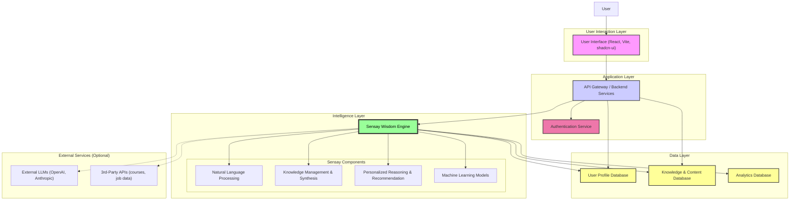

# MentorMindAi ✨

**Unlock Your Potential with AI-Powered Mentorship**

MentorMindAi is a revolutionary platform designed to democratize mentorship and personalized guidance. Everyone deserves access to the wisdom and support needed to thrive in their careers and personal lives. By leveraging our proprietary **Sensay Wisdom Engine**, we deliver smart, context-aware, and actionable mentorship — anytime, anywhere.

---

## 🚀 Vision

To **empower individuals globally** by providing accessible, intelligent, and personalized mentorship. We envision a world where AI mentorship bridges knowledge gaps, nurtures growth, and fosters a thriving community of learners and achievers.

---

## 🎯 What is MentorMindAi?

MentorMindAi is your **AI-driven mentor** — an intelligent companion designed to support you throughout your learning and career journey.

🔍 **Key Features:**
- **Personalized Guidance:** Tailored recommendations based on your goals and learning profile.
- **Skill Development Support:** Curated resources, feedback, and progress tracking.
- **Career Navigation:** Explore job paths, ace interviews, and plan your career smartly.
- **Confidence Boosting:** Encouragement, positive reinforcement, and milestone tracking.
- **Future Vision:** AI-augmented peer and human mentorship for collaborative growth.

---

## 🧠 The Sensay Wisdom Engine

The **Sensay Wisdom Engine** is the AI brain powering MentorMindAi. It integrates advanced technologies to mimic a true mentorship experience.

🔧 **Core Capabilities:**
- **Contextual Understanding:** Grasping the user's goals, preferences, and interaction history.
- **Knowledge Synthesis:** Leveraging curated data, success patterns, and best practices.
- **Personalized Reasoning:** Delivering advice tailored to user-specific challenges.
- **Adaptive Feedback:** Learning and evolving through continuous interaction and results.
- **Conversational AI:** Natural, intuitive conversations through NLP and LLMs.

---

## 🛠️ Technology Stack

MentorMindAi is built using a robust and modern technology stack:

### 💻 Frontend:
- **React** – Dynamic and responsive UI
- **Vite** – Fast build and dev environment
- **TypeScript** – Type-safe, scalable development
- **Tailwind CSS** – Utility-first CSS styling
- **shadcn-ui** – Elegant and accessible UI components

### 🧠 Core AI:
- **Sensay Wisdom Engine** – Proprietary AI system combining:
  - NLP
  - LLMs (e.g., OpenAI, Claude)
  - Recommendation systems
  - Reinforcement Learning
  - Vector databases (e.g., Pinecone/FAISS)

### 🧰 Backend:
- **Node.js / Express** or **Python / FastAPI**
- **PostgreSQL** / **MongoDB** – Flexible data storage
- **Authentication:** JWT, OAuth integrations

### ☁️ Infrastructure:
- **Docker** & **Kubernetes** – Containerization and orchestration
- **AWS / GCP / Azure** – Scalable cloud deployment
- **CI/CD Pipelines** – GitHub Actions / GitLab CI

---

## 🏗️ System Architecture

Below is the high-level architecture of the MentorMindAi platform:


## 🚧 Future Plans

We have an exciting roadmap ahead for MentorMindAi, with plans to continuously enhance its capabilities and reach:

*   **🔁 Deeper Personalization via Feedback Loop:** Implementing advanced feedback mechanisms to allow the Sensay Wisdom Engine to learn and adapt even more precisely to individual user needs and progress.
*   **🧑‍🏫 Human Mentor Integration with AI Augmentation:** Introducing a system where users can connect with real human mentors, with AI assisting in optimal matching based on expertise, goals, and personality, and providing tools for mentors to augment their guidance.
*   **📱 Mobile Applications:** Developing dedicated native mobile apps for both iOS and Android to provide on-the-go access to mentorship and learning.
*   **🌐 Multi-Language Support:** Expanding MentorMindAi's reach by offering its interface and mentorship content in multiple languages.
*   **🧑‍🎓 EdTech Platform Partnerships:** Collaborating with leading educational technology platforms to integrate their content and create enhanced, seamless learning journeys for our users.
*   **📈 Advanced Analytics & Progress Tracking:** Offering more sophisticated dashboards and tools for users to visualize their growth, identify areas for improvement, and celebrate milestones.
*   **🤖 Proactive Nudges & Support:** Enabling the Sensay Wisdom Engine to proactively offer support, resources, or encouragement based on user activity and stated goals.

## 🤝 Contributing

We believe in the power of community and welcome feedback, ideas, and contributions to help shape the future of MentorMindAi. Your insights are invaluable as we strive to build the best possible AI mentorship platform.

To get started with local development:

1.  **Clone the repository:**
    ```bash
    git clone <YOUR_GIT_URL> # Replace with your project's Git URL
    ```
2.  **Navigate to the project directory:**
    ```bash
    cd mentor-mind-ai # Or your project's directory name
    ```
3.  **Install dependencies:**
    ```bash
    npm install
    ```
4.  **Start the development server:**
    ```bash
    npm run dev
    ```

If you'd like to contribute code, please:
1.  Fork the repository.
2.  Create a new branch (`git checkout -b feature/your-feature-name`).
3.  Make your changes and commit them (`git commit -m 'Add some amazing feature'`).
4.  Push to the branch (`git push origin feature/your-feature-name`).
5.  Open a Pull Request.

Please also consider opening an issue to discuss any significant changes or new features you'd like to propose.
